# KVault — Complete Explanation

A single document covering what this project is, how every part of it works,
what each diagram and screenshot shows, how to operate it, and how to answer
questions about it.

Read §1 and §19 if you have ten minutes. Read everything if you have an hour.

---

## Table of contents

| § | Section |
|---|---|
| 1 | [The thirty-second version](#1-the-thirty-second-version) |
| 2 | [The problem](#2-the-problem) |
| 3 | [Architecture](#3-architecture) |
| 4 | [Every file in the repository](#4-every-file-in-the-repository) |
| 5 | [Core concepts](#5-core-concepts) |
| 6 | [The data model](#6-the-data-model) |
| 7 | [The ioctl ABI](#7-the-ioctl-abi) |
| 8 | [How each operation works](#8-how-each-operation-works) |
| 9 | [Cryptography](#9-cryptography) |
| 10 | [Concurrency and locking](#10-concurrency-and-locking) |
| 11 | [Lifecycle](#11-lifecycle) |
| 12 | [Persistence and the file format](#12-persistence-and-the-file-format) |
| 13 | [The audit subsystem](#13-the-audit-subsystem) |
| 14 | [User space in detail](#14-user-space-in-detail) |
| 15 | [Every UML diagram explained](#15-every-uml-diagram-explained) |
| 16 | [Every screenshot explained](#16-every-screenshot-explained) |
| 17 | [Operating it: the full command reference](#17-operating-it-the-full-command-reference) |
| 18 | [The live demo script](#18-the-live-demo-script) |
| 19 | [Interview questions and answers](#19-interview-questions-and-answers) |
| 20 | [Defects found, and what found them](#20-defects-found-and-what-found-them) |
| 21 | [Testing](#21-testing) |
| 22 | [Syllabus coverage map](#22-syllabus-coverage-map) |
| 23 | [Troubleshooting](#23-troubleshooting) |
| 24 | [Glossary](#24-glossary) |

---

## 1. The thirty-second version

> KVault is a Linux kernel module that stores secrets encrypted, keeps the
> master key in kernel memory where no user-space process can reach it, decides
> every access from the caller's real UID inside the kernel, and writes an audit
> record for every attempt — allowed or denied. A user-space CLI and a
> multi-user simulator drive it.

Three claims, and each maps to a thing you can show running:

1. **Confidentiality** — AES-256-GCM, key never on disk, never in user space
   after unseal.
2. **Access control** — a kernel-side *reference monitor* that reads
   `current_uid()` from the calling process's credentials, which the caller
   cannot forge.
3. **Accountability** — an append-only audit log, written by the same code path
   that takes the decision, before the result is returned.

**Scale:** 6,559 lines of C and C++17. 2,173 lines of kernel C across seven
translation units; 1,203 lines of C++ client library; 56 automated test cases
across three tiers, and 98 checks in total once the simulator's 16 steps and
the 26-check scripted session are counted.

---

## 2. The problem

Applications need credentials at runtime: database passwords, API tokens, TLS
private keys. They normally end up in one of three places:

| Where | Who can read it | Who finds out |
|---|---|---|
| A config file | Any process of that user; anyone reading a backup or git history | Nobody |
| An environment variable | Any process of that user, plus anything that can read `/proc/<pid>/environ`; leaks into crash dumps, `ps`, child processes | Nobody |
| A hardcoded constant | Anyone with the binary | Nobody |

Two weaknesses are shared by all three:

**Granularity.** The unit of protection is the Unix file permission, so the
smallest protectable thing is a whole file. Two services running as the same
user can each read the other's credentials, and nothing in the system expresses
the intent that they should not.

**Accountability.** Reading a config file is an ordinary file read. Nothing
distinguishes the application loading its own password from a compromised
process reading it for the first time. There is no record to consult after an
incident.

**Encrypting the file does not fix either.** The application must decrypt it,
so the key must be somewhere the application can reach — the problem has moved,
not gone.

KVault moves the key, the decision and the record into the kernel.

---

## 3. Architecture

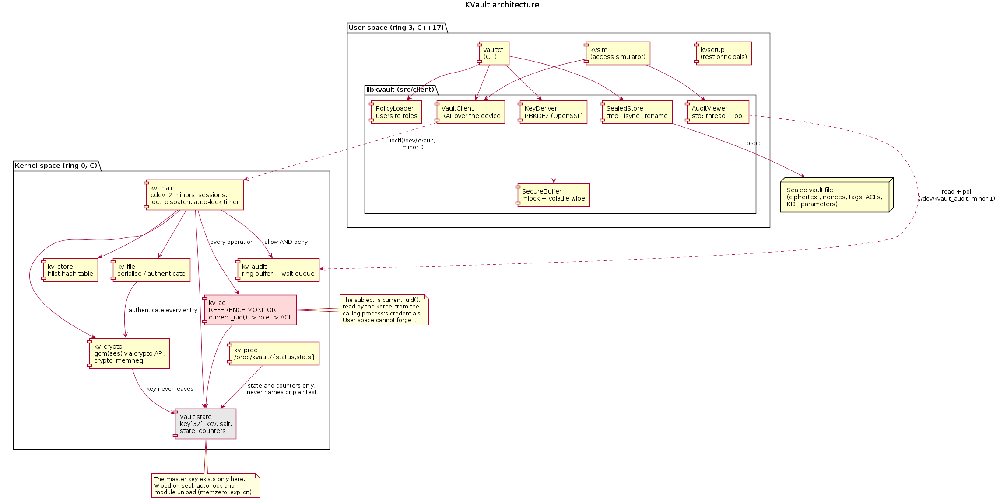

The syscall boundary is the security boundary. Everything above it is ordinary
user-space C++; everything below is kernel C.

```
USER SPACE (ring 3, C++17)
  vaultctl ── CLI            kvsim ── simulator      kvsetup ── test principals
       │                          │
       └──────── libkvault (src/client) ─────────────┐
            VaultClient  KeyDeriver  SecureBuffer
            SealedStore  PolicyLoader  AuditViewer  Passphrase
                  │                              │
══════════════════╪══════ syscall boundary ══════╪═══════════════════════
                  │ ioctl(/dev/kvault)           │ read+poll(/dev/kvault_audit)
KERNEL SPACE (ring 0, C — kvault.ko)
  kv_main    cdev, 2 minors, sessions, ioctl dispatch, auto-lock timer
  kv_acl     THE REFERENCE MONITOR — current_uid() → role → ACL
  kv_crypto  gcm(aes) via the kernel crypto API, crypto_memneq
  kv_store   hlist hash table of encrypted entries
  kv_file    serialise / authenticate the sealed blob
  kv_audit   ring buffer + wait queue
  kv_proc    /proc/kvault/{status,stats}
  ── vault state: key[32], kcv, salt, state, counters ──
```

### Why two device minors

| Node | Minor | Interface | Group | Audience |
|---|---|---|---|---|
| `/dev/kvault` | 0 | `ioctl` | `kvault` (0660) | processes that issue commands |
| `/dev/kvault_audit` | 1 | `read`, `poll` | `kvaudit` (0440) | processes that observe |

Two audiences with different rights, so file permissions should be able to
separate them. `kv_carol`, the auditor, is in `kvaudit` and **not** in
`kvault`: she can follow the log and cannot open the control device at all.
This is defence in depth — the kernel's RBAC check would refuse her anyway, but
there is no reason to let her hold a descriptor to the command channel.

---

## 4. Every file in the repository

### Kernel module — `driver/` (2,173 lines, seven translation units)

| File | Lines | Responsibility |
|---|---|---|
| `kv_main.c` | 1,033 | Char device registration, two minors, per-open sessions, all 13 ioctl handlers, auto-lock timer, module init/exit, module parameters |
| `kv_file.c` | 263 | Serialise the vault to a sealed blob; parse and authenticate it back. Contains all the untrusted-input bounds checking |
| `kv_crypto.c` | 232 | AES-256-GCM through the kernel crypto API; SHA-256 key-check value; constant-time comparison; accelerated-driver detection |
| `kv_acl.c` | 163 | **The reference monitor.** Role lookup, ACL evaluation, admin check, creation check |
| `kv_audit.c` | 160 | Append-only ring buffer, wait queue, blocking reader, per-reader cursors |
| `kv_proc.c` | 90 | `/proc/kvault/status` and `/proc/kvault/stats` |
| `kv_store.c` | 84 | Hash table of secrets: find, insert, remove, clear |
| `kv_internal.h` | 148 | Private definitions — nothing here crosses the syscall boundary |
| `Kbuild` | 3 | Kernel build description |

### Shared ABI — `include/` (276 lines)

| File | Lines | Responsibility |
|---|---|---|
| `kvault_ioctl.h` | 276 | **Compiled verbatim by both sides.** All ioctl numbers, argument structs, permission bits, role IDs, operation codes, and the on-disk format |

### User-space library — `src/client/` (1,203 lines)

| File | Lines | Responsibility |
|---|---|---|
| `VaultClient.{hpp,cpp}` | 357 | RAII wrapper over the device; one method per ioctl; throws `VaultError` carrying the errno |
| `SealedStore.{hpp,cpp}` | 239 | Durable file write (temp → fsync → rename → fsync dir); header parsing |
| `PolicyLoader.{hpp,cpp}` | 176 | Parses `policy.conf`; role names, permission strings, subject specs |
| `AuditViewer.{hpp,cpp}` | 168 | Follows the audit stream on a `std::thread` |
| `Passphrase.{hpp,cpp}` | 117 | Terminal echo suppression via an RAII guard |
| `SecureBuffer.hpp` | 69 | Template; `mlock`ed, self-wiping, non-copyable byte buffer |
| `KeyDeriver.{hpp,cpp}` | 77 | PBKDF2-HMAC-SHA256 over OpenSSL; CSPRNG salts and nonces |

### Tools — `src/cli/`, `src/sim/`, `src/tools/` (1,367 lines)

| File | Lines | Responsibility |
|---|---|---|
| `cli/main.cpp` | 397 | `vaultctl` — 16 commands |
| `sim/main.cpp` | 333 | `kvsim` — seeds the vault, forks one child per principal, collects the results table, prints the kernel's audit log |
| `sim/SimUser.{hpp,cpp}` | 235 | `SimUser` base class and the four role subclasses |
| `sim/ScenarioLoader.{hpp,cpp}` | 199 | Parses `scenario-default.conf` |
| `tools/kvsetup.cpp` | 203 | Creates the test users and the two groups via `fork`/`execvp`/`waitpid` |

### Tests — `tests/` (1,540 lines)

| File | Cases | Covers |
|---|---|---|
| `kvtest.hpp` | — | The harness: `KV_TEST`, `KV_CHECK`, `KV_REQUIRE`, `KV_EXPECT_ERRNO`, skip tracking |
| `unit/test_crypto_helpers.cpp` | 7 | `SecureBuffer` wipe, KDF determinism and sensitivity, CSPRNG |
| `unit/test_policy.cpp` | 7 | Policy parsing, permission notation, error line numbers |
| `unit/test_scenario.cpp` | 8 | Scenario parsing, grouping, malformed directives, the shipped file |
| `unit/test_sealedstore.cpp` | 11 | Durable write, file mode, header parsing, rejection cases |
| `integration/test_ioctl.cpp` | 19 | Every ioctl, every boundary, a 400-iteration fuzz |
| `system/test_lifecycle.cpp` | 4 | Concurrency, auto-lock, locked-vault denial |
| `system/bench_crypto.cpp` | — | Throughput of the full GET path |

### Configuration, docs, scripts

| Path | Purpose |
|---|---|
| `configs/policy.conf` | Which system users hold which role |
| `configs/scenario-default.conf` | What the simulator seeds, grants and attempts |
| `scripts/99-kvault.rules` | udev rule giving the two nodes their groups |
| `docs/01-introduction.md` … `06-test-report.md` | The six project documents |
| `docs/uml/*.puml`, `*.png` | Eight UML models, sources and renders |
| `docs/screenshots/*.png`, `transcripts/*.log` | The seven-step demo |
| `Makefile`, `tests/Makefile` | Build system |

---

## 5. Core concepts

### 5.1 The reference monitor

A term from the Anderson report (1972). A reference monitor is the single
component every access must pass through, and it must be:

1. **Impossible to bypass** — here, the device is the only path to the
   ciphertext, and the key exists nowhere else.
2. **Impossible to tamper with** — it lives in ring 0; a user-space process
   cannot patch it, `ptrace` it, or read its memory.
3. **Small enough to verify** — `kv_acl.c` is 163 lines.

In KVault the reference monitor is `kv_acl_check()`, called by every operation
that touches a secret.

### 5.2 The subject: `current_uid()`

The *subject* of every decision is the calling process's real UID, obtained
from the kernel's own credential structure. **It is not something the caller
sends.** A process can only change its UID through a syscall the kernel itself
authorised (`setuid` family), so by the time control reaches the ioctl handler
the identity is already established and unforgeable from user space.

### 5.3 Permissions

Four bits, stored in an ACL entry:

| Bit | Value | Meaning |
|---|---|---|
| `KV_PERM_READ` | 1 | May `GET` the plaintext |
| `KV_PERM_WRITE` | 2 | May overwrite (`PUT`) or re-encrypt (`ROTATE`) |
| `KV_PERM_DELETE` | 4 | May `DELETE` |
| `KV_PERM_GRANT` | 8 | May `GRANT`/`REVOKE` on this secret |

Written in the CLI as letters: `r`, `w`, `d`, `g`. So `vaultctl grant x
developer rw` gives read and write.

**Creation is deliberately not a bit.** See §5.5.

### 5.4 Roles

| Role | ID | Default permissions | May create? |
|---|---|---|---|
| `admin` | 1 | everything | yes |
| `developer` | 2 | **none** | yes |
| `auditor` | 3 | **none** | no |
| `guest` | 4 | **none** | no |

Role defaults apply only when no ACL entry matches. Everything except admin
defaults to zero — **least privilege**: a principal nobody has said anything
about gets nothing.

A developer has no blanket access. Developers get access per secret, via a
grant. That is the whole point of the alice/bob contrast in the simulation:
same role, different ACLs, different answers.

### 5.5 Why creation is answered separately

`kv_role_may_create()` in `kv_acl.c` answers one question: may this role bring
a *new* name into existence?

It cannot be an ACL check, because ACLs attach to an object and at creation
time there is none. It also cannot be folded into `kv_role_defaults[]`, because
those are the *fallback for existing secrets* — giving the developer role a
default `WRITE` so it could create would grant it write access to every secret
in the vault.

**This distinction was discovered by a failing test, not by design.** See §20,
defect 5. It is the most interesting thing in the project.

### 5.6 The decision procedure, in order

`kv_acl_check(secret, uid, wanted_permission)`:

1. **Owner?** The creating UID retains full control of its own secret. → allow
2. **Admin role?** → allow
3. **ACL entry for this UID?** First match decides, fully — including denying.
4. **ACL entry for this UID's role?** Same.
5. **Role default** from `kv_role_defaults[]` — zero for everyone but admin.

---

## 6. The data model

### 6.1 Kernel structures

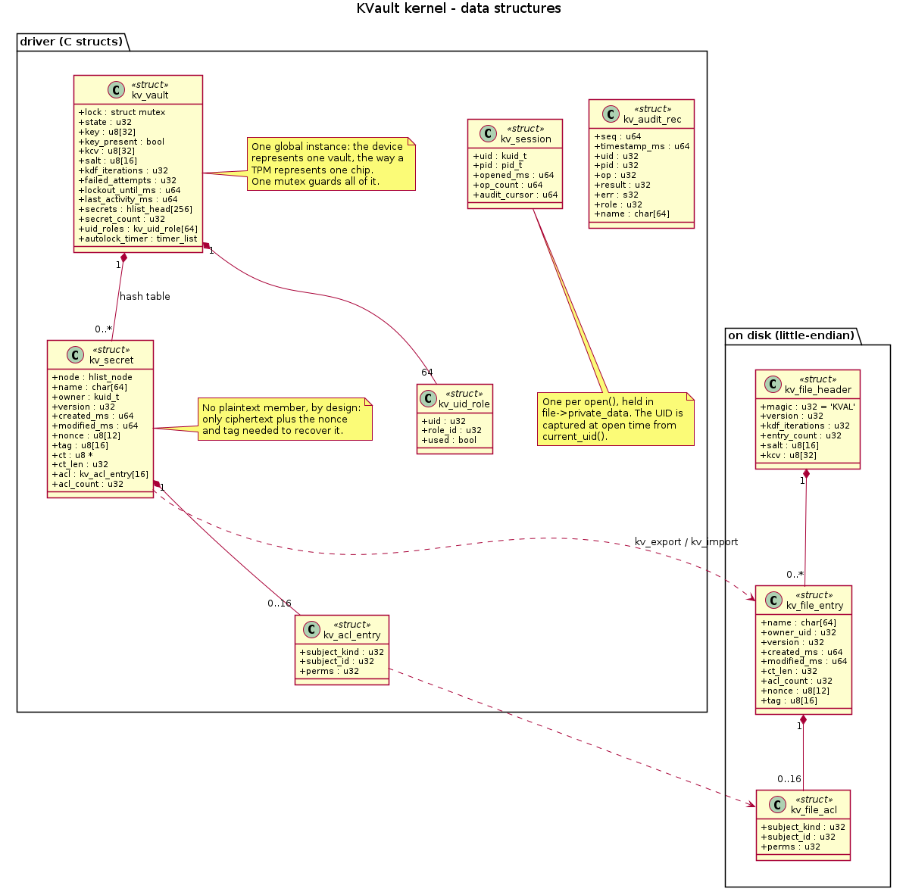

#### `struct kv_vault` — the whole vault, one global instance

| Field | Type | Purpose |
|---|---|---|
| `lock` | `struct mutex` | Guards everything else in the struct |
| `state` | `u32` | `SEALED`/`UNSEALED`/`AUTO_LOCKED`/`LOCKED_OUT` |
| `key` | `u8[32]` | The AES-256 master key — **only copy anywhere** |
| `key_present` | `bool` | Whether `key` holds anything |
| `kcv` | `u8[32]` | SHA-256 of the key, for passphrase checking |
| `salt` | `u8[16]` | PBKDF2 salt, recorded at first unseal |
| `kdf_iterations` | `u32` | PBKDF2 iteration count |
| `failed_attempts` | `u32` | Consecutive failed unseals |
| `lockout_until_ms` | `u64` | Wall-clock deadline, 0 when not locked out |
| `last_activity_ms` | `u64` | Drives the idle display in procfs |
| `secrets[256]` | `hlist_head[]` | Hash table of secrets |
| `secret_count` | `u32` | How many |
| `uid_roles[64]` | `kv_uid_role[]` | UID → role bindings |
| `autolock_timer` | `struct timer_list` | Fires after inactivity |

One global instance because the device represents one vault, the way a TPM
represents one chip.

#### `struct kv_secret` — one stored secret

| Field | Type | Purpose |
|---|---|---|
| `node` | `hlist_node` | Hash chain linkage |
| `name` | `char[64]` | Including the NUL |
| `owner` | `kuid_t` | Creating UID |
| `version` | `u32` | Bumped on every overwrite and rotate |
| `created_ms`, `modified_ms` | `u64` | Timestamps |
| `nonce` | `u8[12]` | GCM nonce, fresh on every write |
| `tag` | `u8[16]` | GCM authentication tag |
| `ct` | `u8 *` | Ciphertext, separately allocated |
| `ct_len` | `u32` | Its length — same as the plaintext length, GCM being a stream cipher mode |
| `acl[16]` | `kv_acl_entry[]` | Access control entries |
| `acl_count` | `u32` | How many are used |

**There is no plaintext member.** That is a design statement: the struct holds
ciphertext plus exactly what is needed to recover it, and nothing that is
useful without the key.

#### `struct kv_session` — one per `open()`

| Field | Purpose |
|---|---|
| `uid` | Captured from `current_uid()` at open time |
| `pid` | For the audit record |
| `opened_ms`, `op_count` | Diagnostics |
| `audit_cursor` | **Audit minor only:** the next sequence number this reader wants |

Held in `file->private_data`. The per-reader cursor is what makes audit readers
independent: a slow reader cannot block a writer, and each sees every record
from the moment it opened.

#### `struct kv_audit_rec` — one audit record

`seq`, `timestamp_ms`, `uid`, `pid`, `op`, `result`, `err`, `role`, `name[64]`.

Fixed size, so a short read can never split a record. Contains no plaintext and
no key material.

### 6.2 Sizes and limits

| Constant | Value | Why |
|---|---|---|
| `KV_NAME_MAX` | 64 | Including NUL |
| `KV_SECRET_MAX` | 4096 | Keeps each buffer one allocation; bounds worst-case time under the mutex |
| `KV_KEY_LEN` | 32 | AES-256 |
| `KV_NONCE_LEN` | 12 | GCM standard |
| `KV_TAG_LEN` | 16 | Full-strength GCM tag |
| `KV_SALT_LEN` | 16 | 128-bit salt |
| `KV_KCV_LEN` | 32 | SHA-256 output |
| `KV_ACL_MAX` | 16 | Per secret |
| `KV_LIST_MAX` | 64 | Constrained by `_IOC_SIZEBITS` — see §7.2 |
| `KV_BLOB_MAX` | 1 MiB | Sealed vault ceiling |
| `KV_HASH_BITS` | 8 | 256 buckets |
| `KV_AUDIT_RING_SIZE` | 1024 | Power of two, enforced by `BUILD_BUG_ON` |

### 6.3 Module parameters

All writable at runtime through `/sys/module/kvault/parameters/`, mode 0644.

| Parameter | Default | Meaning |
|---|---|---|
| `autolock_secs` | 300 | Idle seconds before the key is wiped; 0 disables |
| `max_attempts` | 3 | Failed unseals before lockout |
| `lockout_secs` | 60 | Cooldown duration |
| `max_secrets` | 1024 | Namespace bound |

```bash
sudo insmod driver/kvault.ko autolock_secs=30 max_attempts=5
echo 10 | sudo tee /sys/module/kvault/parameters/autolock_secs
```

---

## 7. The ioctl ABI

### 7.1 The thirteen commands

Magic number `'K'`. Numbers are grouped: 1–3 lifecycle, 10–14 secrets, 20–22
access control, 30–31 persistence. Gaps are intentional so a later addition
does not have to renumber.

| Command | Number | Direction | Argument | Admin? |
|---|---|---|---|---|
| `KVAULT_UNSEAL` | 1 | `_IOW` | `kv_unseal_arg` | **yes** |
| `KVAULT_SEAL` | 2 | `_IO` | — | **yes** |
| `KVAULT_STATUS` | 3 | `_IOR` | `kv_status_arg` | no |
| `KVAULT_PUT` | 10 | `_IOW` | `kv_secret_arg` | no |
| `KVAULT_GET` | 11 | `_IOWR` | `kv_secret_arg` | no |
| `KVAULT_DELETE` | 12 | `_IOW` | `kv_name_arg` | no |
| `KVAULT_LIST` | 13 | `_IOR` | `kv_list_arg` | no |
| `KVAULT_ROTATE` | 14 | `_IOW` | `kv_name_arg` | no |
| `KVAULT_GRANT` | 20 | `_IOW` | `kv_grant_arg` | needs `GRANT` |
| `KVAULT_REVOKE` | 21 | `_IOW` | `kv_grant_arg` | needs `GRANT` |
| `KVAULT_SET_ROLE` | 22 | `_IOW` | `kv_setrole_arg` | **yes** |
| `KVAULT_EXPORT` | 30 | `_IOWR` | `kv_blob_arg` | **yes** |
| `KVAULT_IMPORT` | 31 | `_IOW` | `kv_blob_arg` | **yes** |

"Admin" means **both** the admin role *and* `CAP_SYS_ADMIN`. The role is vault
policy; the capability is the kernel's own notion of privilege. Requiring both
means a stale role binding inherited by a recycled UID is not enough on its own.

### 7.2 The `_IOC_SIZEBITS` constraint — an exam-worthy detail

An ioctl command number packs direction, type, number **and size** into 32
bits. The size field is 14 bits, so the largest struct an `_IOW`/`_IOR`/`_IOWR`
command can describe is **16,383 bytes**.

This broke two structures that had been designed on paper:

- `kv_list_arg` was 256 × 64 + 8 = **16,392 bytes** — nine bytes too big.
  Fixed by reducing `KV_LIST_MAX` to 64, giving 4,104 bytes.
- `kv_blob_arg` held a 1 MiB inline buffer — hopeless. Fixed by making it a
  **descriptor**: a `__u64` holding a user-space address plus a length. The
  blob then makes a second trip through that pointer, validated by
  `copy_to_user`/`copy_from_user`.

`__u64` rather than a real pointer keeps the struct the same size for 32- and
64-bit callers, so a 32-bit program on a 64-bit kernel sees the same layout.

The compiler reports this as `error: case label does not reduce to an integer
constant`, which is a famously unhelpful message for the underlying cause.

### 7.3 Errors, and what each means

| errno | Meaning in KVault |
|---|---|
| `EACCES` | **The reference monitor said no.** The important one |
| `EPERM` | The vault is sealed or locked — there is no key |
| `ENOENT` | No such secret, or revoking an ACL entry that is not there |
| `EINVAL` | Malformed request: bad name, zero-length value, undefined permission bits, corrupt blob header |
| `ENAMETOOLONG` | Name ≥ 64 bytes (raised in user space) |
| `E2BIG` | Value > 4096 bytes |
| `ENOSPC` | `GET` buffer too small, ACL full, or `max_secrets` reached |
| `EBADMSG` | **GCM tag check failed** — the data was tampered with |
| `EAGAIN` | Locked out; try again after the cooldown |
| `EALREADY` | Already unsealed |
| `ENOTTY` | Not one of our ioctls, or an ioctl sent to the audit minor |
| `EFAULT` | A bad user-space pointer |
| `EPROTO` | Vault file version this build does not understand |

The distinction between `EACCES` and `EINVAL` matters: the simulator uses it to
report "denied" rather than "broken".

---

## 8. How each operation works

### 8.1 `UNSEAL` — the only time a key crosses the boundary

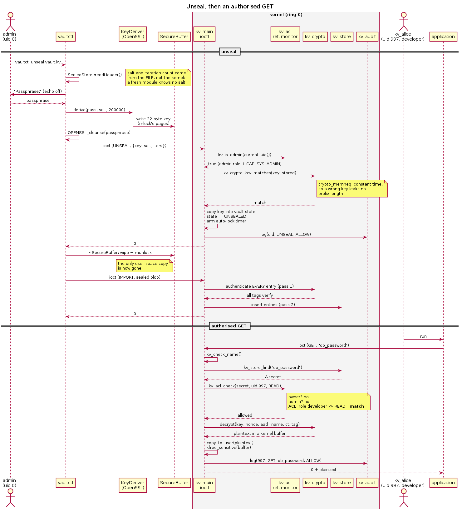

**User space:**
1. `vaultctl unseal /path/vault.kv` reads the file **header** to get the salt
   and iteration count. (Why the file and not the kernel: §12.3.)
2. Prompts for the passphrase with terminal echo disabled.
3. `KeyDeriver::derive()` runs PBKDF2-HMAC-SHA256, 200,000 iterations, into a
   `SecureBuffer<32>` whose pages are `mlock`ed.
4. The passphrase string is wiped with `OPENSSL_cleanse`.
5. `ioctl(KVAULT_UNSEAL, {key, salt, iterations, abi_version})`.
6. `~SecureBuffer` wipes and `munlock`s. **User space now holds nothing.**

**Kernel space:**
1. `kv_is_admin()` — admin role **and** `CAP_SYS_ADMIN`, else `EACCES` + audit.
2. Allocate the argument struct with `kzalloc` (it is too big for the stack)
   and `copy_from_user`.
3. Validate `abi_version` and a non-zero iteration count.
4. Take the mutex; expire any stale lockout.
5. If `LOCKED_OUT` → `EAGAIN` **without performing the key check at all**.
6. If `UNSEALED` → `EALREADY`.
7. **If no KCV yet** (a fresh vault): adopt this key. Compute and store
   `SHA-256(key)`, record the salt and iterations. There is nothing to check
   against, and refusing would make the vault permanently unusable.
8. **Otherwise** compare with `crypto_memneq`. On mismatch: increment the
   counter; if it reaches `max_attempts`, move to `LOCKED_OUT`, set the
   deadline, audit a `LOCKOUT` record. Return `EACCES`.
9. On success: copy the key into vault state, state := `UNSEALED`, reset the
   counter, arm the auto-lock timer, audit `ALLOW`.
10. `kfree_sensitive(arg)` — **on every path**, because a rejected key is as
    worth wiping as an accepted one.

### 8.2 `PUT` — store or overwrite

1. `kzalloc` + `copy_from_user` of the 4 KiB argument.
2. `kv_check_name()` — forces NUL termination, rejects empty, rejects anything
   outside `[A-Za-z0-9_.-]`. Done **once, centrally**, before any name reaches
   the store or the log.
3. Reject zero-length and over-length values.
4. Take the mutex. Require `UNSEALED`, else `EPERM`.
5. **If the secret exists:** require `WRITE` via `kv_acl_check`.
   **If it does not:** require `kv_role_may_create(role)`, and check
   `secret_count < max_secrets`.
6. `get_random_bytes(nonce, 12)` — a fresh nonce, always.
7. Allocate the ciphertext buffer and encrypt, with the **secret's name as
   associated data**.
8. Insert if new; owner is the caller.
9. **Only now** free the old ciphertext and install the new. A failure anywhere
   above leaves the existing secret intact.
10. Re-arm the auto-lock timer; audit; unlock; `kfree_sensitive(arg)`.

### 8.3 `GET` — the path the whole project exists for

1. Copy in, validate the name.
2. Lock; require `UNSEALED`.
3. `kv_store_find()` → `ENOENT` if absent.
4. **`kv_acl_check(s, uid, KV_PERM_READ)`** — the reference monitor. Everything
   above this line is parsing; everything below has been authorised.
5. Check the caller's buffer is big enough (`ENOSPC`).
6. Decrypt into the kernel-side argument buffer, name as AAD.
7. Audit, unlock.
8. **Only on success** `copy_to_user`. A denied or failed `GET` copies nothing
   back — not even the zeroed buffer. There is no path that returns a partial
   result.
9. `kfree_sensitive(arg)` wipes the plaintext from kernel memory.

### 8.4 `GRANT` / `REVOKE`

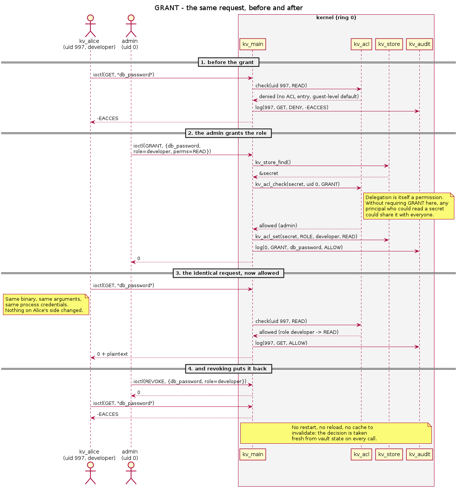

Requires `KV_PERM_GRANT` **on that secret** — which owner and admin hold
implicitly. Delegation is itself a permission: without this check any principal
who could *read* a secret could share it with everyone, and the ACL would
describe a lower bound on access rather than an upper one.

`kv_acl_set()` replaces an existing entry for the same subject, or appends;
`kv_acl_revoke()` removes by swapping in the last entry and decrementing the
count (order within the ACL is not significant).

### 8.5 `LIST` — and why it omits rather than denies

Walks all 256 buckets, calling `kv_acl_check(..., READ)` on each, and copies
only the names that pass. Secrets the caller cannot read are **omitted**, not
reported as denied.

Reporting "7 secrets, you may read 1" would leak the shape of the namespace,
and names are informative on their own — `stripe_live_key` tells an attacker
what the system does and what is worth attacking.

### 8.6 `ROTATE`

Decrypts to a kernel buffer, draws a fresh nonce, re-encrypts, bumps the
version. The plaintext round-trips through a buffer that is wiped before the
function returns, so a failure part-way leaves no decrypted copy behind.

Used after a suspected exposure of ciphertext, or on a schedule, to limit how
much material is encrypted under one nonce.

---

## 9. Cryptography

### 9.1 The rule

**Do not invent cryptography.** KVault uses AES-256-GCM from the kernel crypto
API and PBKDF2 from OpenSSL. The contribution of this project is the system
design — the access control, the audit, the lifecycle — not new primitives.

### 9.2 AES-256-GCM via the kernel crypto API

`crypto_alloc_aead("gcm(aes)", 0, 0)` asks the kernel for *an* implementation
of GCM-over-AES; the kernel picks the highest-priority registered driver.

On this machine `/proc/crypto` offers three:

| Driver | Priority |
|---|---|
| `generic-gcm-vaes-avx2` | 600 ← **selected** |
| `generic-gcm-aesni-avx` | 500 |
| `generic-gcm-aesni` | 400 |

This CPU reports both `aes` and `vaes`, so the VAES/AVX2 implementation wins.

**The AES-NI detection bug.** The first version tested the driver name for the
substring `"aesni"` and therefore reported *no acceleration on exactly the
fastest hardware available*. `kv_crypto_accelerated()` now matches the
accelerated families (`aesni`, `vaes`, `aes-ce`, `ccp`, `padlock`), and both
`STATUS` and `/proc/kvault/stats` report the **driver name** so a measurement
can say which code path it measured.

### 9.3 Why GCM and not CBC

Tamper detection is a requirement, not an extra. CBC gives confidentiality and
nothing else; detecting modification would mean bolting on a MAC and getting
the composition order right (encrypt-then-MAC — a classic source of bugs). GCM
is an AEAD: it authenticates in the same pass, and the 16-byte tag is what
turns a flipped byte in the vault file into a rejected import rather than
silent corruption.

### 9.4 The name as associated data — a subtle and important choice

`kv_gcm()` passes the secret's 64-byte name as GCM **associated data**: it is
authenticated but not encrypted.

Without this, consider an attacker who can edit the vault file. They swap the
ciphertext, nonce and tag of `db_password` into the entry named `public_motd`.
Every tag still verifies — the tag covers the ciphertext, which was not
changed. A principal allowed to read `public_motd` is now served the contents
of `db_password`.

Binding the name makes that swap fail: the name is part of what was
authenticated, so the tag check rejects it.

### 9.5 The scatterlist layout

The kernel AEAD interface works on scatterlists and expects one contiguous
logical layout:

```
[ associated data | payload | tag ]
```

`kv_gcm()` assembles that in a single scratch allocation rather than
scatter-gathering across the caller's separate buffers. The buffers are at most
4 KiB, so the copy is cheaper than getting the sg bookkeeping subtly wrong, and
the scratch is wiped in **one place** on every exit path.

For encryption, `cryptlen` is the plaintext length and the tag is written after
the ciphertext. For decryption, `cryptlen` is ciphertext + tag. The IV is
copied because the AEAD code may write to the buffer and the caller's stored
nonce must not be disturbed.

### 9.6 Nonce handling

`get_random_bytes()` on every `PUT` and every `ROTATE`. Never a counter.

Nonce reuse under one key does not weaken GCM — **it collapses it**. Two
messages under the same key and nonce leak the XOR of their plaintexts, and
worse, they leak the GHASH authentication key, which lets an attacker forge
tags. A counter would be cheaper and is the wrong answer: restoring a backup
would rewind it.

### 9.7 PBKDF2 and the key-check value

PBKDF2-HMAC-SHA256, **200,000 iterations**, run in user space. The kernel never
sees a passphrase, only a 32-byte derived key. A slow KDF is harmless in user
space and would be a problem in the kernel (holding a mutex, or in softirq).

The **key-check value** is `SHA-256(derived_key)`. It lets `UNSEAL` distinguish
a right passphrase from a wrong one without storing anything that could
reconstruct the key. It is compared with `crypto_memneq`.

### 9.8 Constant-time comparison

`memcmp` returns as soon as it finds a differing byte. An attacker who can time
the call learns *how many leading bytes were correct* — enough, over many
attempts, to recover the value a byte at a time. `crypto_memneq` always reads
both buffers in full and accumulates differences, so the timing is independent
of the data.

The lockout limits attempts, but defence should not rest on one mechanism.

### 9.9 Memory hygiene

| Mechanism | Where | Why |
|---|---|---|
| `memzero_explicit()` | Key wipe on seal/auto-lock/unload | `memset` may be **deleted entirely** by the compiler when it can prove the result is never read — exactly the case here |
| `kfree_sensitive()` | Every argument struct, ciphertext, scratch | Zeroes before freeing |
| `mlock()` | `SecureBuffer` | Stops the derived key reaching swap |
| volatile write loop | `SecureBuffer::wipe()` | The user-space equivalent of `memzero_explicit` |
| `OPENSSL_cleanse()` | Passphrase strings, staging buffers | Same reason |

---

## 10. Concurrency and locking

### 10.1 One mutex

All vault state is serialised by `kv_vault.lock`. Coarse, and appropriate:
operations are short, contention is low, and a finer scheme would buy
throughput nobody needs at the cost of correctness arguments nobody wants to
make in kernel code.

There is a second reason: the AEAD transform is shared and `crypto_aead_setkey`
writes to it, so two concurrent operations would race on the key regardless.

**Measured, not assumed:** 8 processes × 50 concurrent reads and 6 threads × 40
interleaved put/get/list, with a full `GET` at 1.3 µs. Zero mismatches.

### 10.2 A spinlock for the audit ring

The audit ring uses a **spinlock**, not the mutex, because it is written from
timer (softirq) context where sleeping is forbidden. `kv_audit_log()` never
sleeps, so it is safe to call *with the vault mutex held* — which is what lets
a decision and its record be written with no window between them.

### 10.3 The timer and `mutex_trylock`

`kv_autolock_fn()` runs in softirq context and therefore uses
`mutex_trylock()`, re-arming for one second if the lock is held rather than
blocking. **A timer that blocked on a mutex would be a deadlock.**

### 10.4 Per-reader audit cursors

Each open of the audit minor gets its own cursor in its `kv_session`. Readers
are independent: a slow reader cannot block a writer, and a reader that falls
more than one ring behind is fast-forwarded to the oldest surviving record.

---

## 11. Lifecycle

### 11.1 The vault state machine

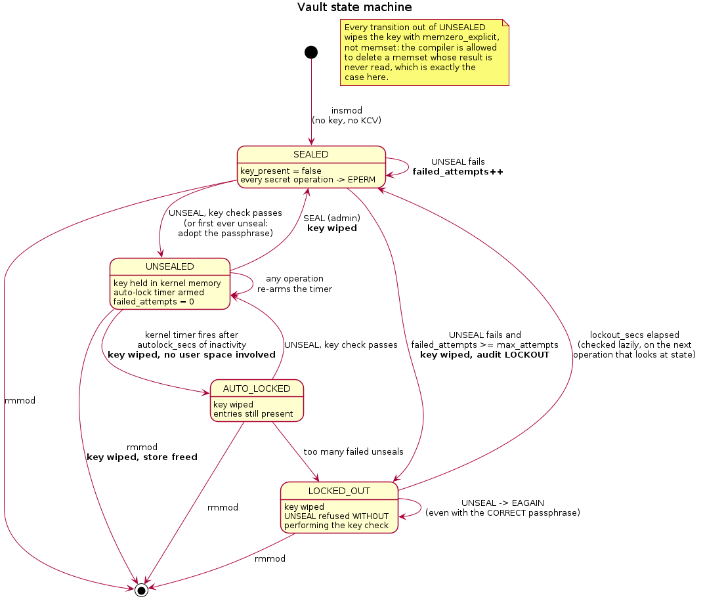

| State | Key present? | Behaviour |
|---|---|---|
| `SEALED` | no | Every secret operation → `EPERM` |
| `UNSEALED` | **yes** | Normal operation; timer armed |
| `AUTO_LOCKED` | no | Same as sealed; entries still present |
| `LOCKED_OUT` | no | `UNSEAL` → `EAGAIN` without checking the key |

**Every edge leaving `UNSEALED` wipes the key.**

Two edges worth calling out:

- `UNSEALED → AUTO_LOCKED` is taken by a **kernel timer**, with no user-space
  process involved. Nothing has to be running for the vault to protect itself.
- `LOCKED_OUT → LOCKED_OUT` on `UNSEAL` returns `EAGAIN` *without performing
  the key check*, so **the correct passphrase is refused during the cooldown
  too**. An attacker who has exhausted the attempt budget learns nothing
  further — not even how long a check took.

The lockout deadline is evaluated **lazily**, by `kv_expire_lockout()` on the
next operation that inspects state. No timer is needed to leave the state.

### 11.2 The secret state machine

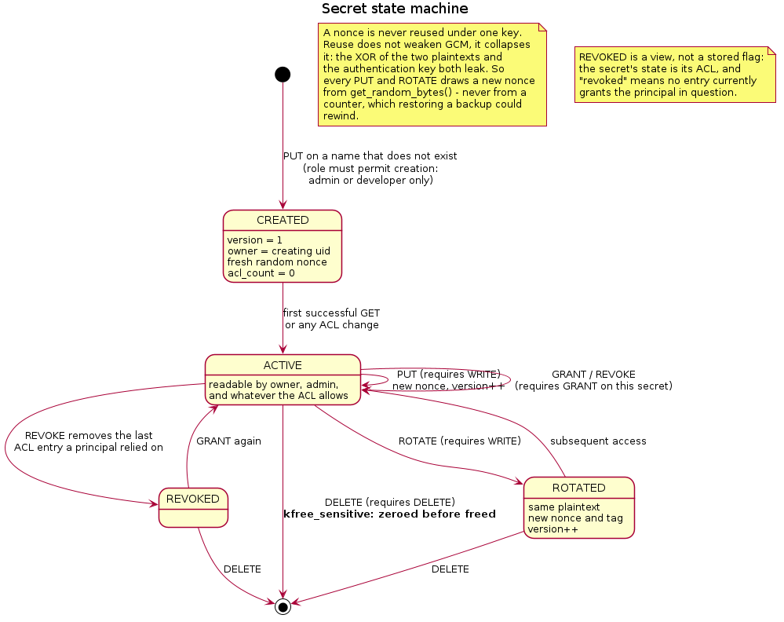

`CREATED → ACTIVE → ROTATED → ACTIVE`, with `REVOKED` and `DELETED`.

`REVOKED` is **a view, not a stored flag**: a secret's state is its ACL, and
"revoked" means no entry currently grants the principal in question. Modelling
it as stored state would create the possibility of the flag and the ACL
disagreeing.

---

## 12. Persistence and the file format

### 12.1 The split of responsibility

**The kernel never touches the filesystem.** `EXPORT` hands out a blob; user
space writes it; `IMPORT` takes it back. This keeps file I/O — paths,
permissions, error handling — out of ring 0 entirely.

### 12.2 The format

```
struct kv_file_header            (little-endian, 64 bytes)
    magic           u32   'KVAL' = 0x4B56414C
    version         u32   1
    kdf_iterations  u32
    entry_count     u32
    salt            u8[16]
    kcv             u8[32]

then, per entry:
struct kv_file_entry
    name            char[64]
    owner_uid       u32
    version         u32
    created_ms      u64
    modified_ms     u64
    ct_len          u32
    acl_count       u32
    nonce           u8[12]
    tag             u8[16]
  followed by acl_count × kv_file_acl, then ct_len ciphertext bytes
```

**Every multi-byte field is written little-endian with `cpu_to_le32()`** even
though the development host is already little-endian. A format whose byte order
is "whatever the writer happened to use" is not a format, and the bug would
only ever appear on someone else's hardware.

### 12.3 Why user space parses the header — and only the header

Importing requires the right key loaded; deriving the right key requires the
salt; **the salt is in the file.** So something outside the kernel must read
the header before the kernel can be given anything.

That is not a weakness. The salt and iteration count are *public* KDF
parameters: their job is to make one precomputed table useless against many
vaults, not to stay hidden.

The entry bodies stay opaque to user space. A user-space parser for them would
be a second implementation of the format and a second chance to get its bounds
checks wrong.

### 12.4 Two-pass import

```
pass 0: for every entry — bounds-check, then DECRYPT to verify the tag
pass 1: only if pass 0 succeeded entirely — clear the store, insert
```

A damaged file therefore cannot half-load. The tests confirm this by reading a
secret back *after* a rejected import.

Before either pass, the file's KCV is compared with the loaded key's. That turns
"every entry failed its tag" into one clear answer: **wrong passphrase**, not a
corrupt file.

### 12.5 Bounds checking against untrusted input

Everything in the blob may have been edited by anyone who could reach the file.
Bounds are checked by **subtracting from what remains**:

```c
if (len - off < sizeof(e))      /* correct */
    return -EINVAL;
```

never by adding to the offset:

```c
if (off + sizeof(e) > len)      /* WRONG — off + size can wrap */
    return -EINVAL;
```

`off + need` can overflow and produce a small number that passes a comparison
it should fail. This is a classic integer-overflow parsing bug and the reason
the arithmetic is written the way it is.

### 12.6 What is in the file, and what is not

| In the file | Not in the file |
|---|---|
| Ciphertext, nonces, tags | The key |
| **ACLs**, including role-subject ones | **UID → role bindings** |
| KDF salt and iteration count | The passphrase |
| Secret names, owners, timestamps | Any plaintext |

**Role bindings are host configuration, not vault content.** They map local
UIDs, which mean nothing on another machine. They come from `policy.conf` and
are re-applied after a load. The test suite asserts both halves: bob's
UID-subject ACL survives a reload, while alice is denied until the policy is
re-applied.

### 12.7 The durable write

`SealedStore::save()`:

1. Write to `path.tmp` (mode 0600)
2. `fsync(tmp_fd)` — the bytes are really on the medium
3. `rename(tmp, path)` — atomic within a filesystem
4. **`fsync(dir_fd)`** — make the rename itself durable

Skipping step 4 is the usual mistake: the file's contents are durable but the
directory entry still points at the old inode.

---

## 13. The audit subsystem

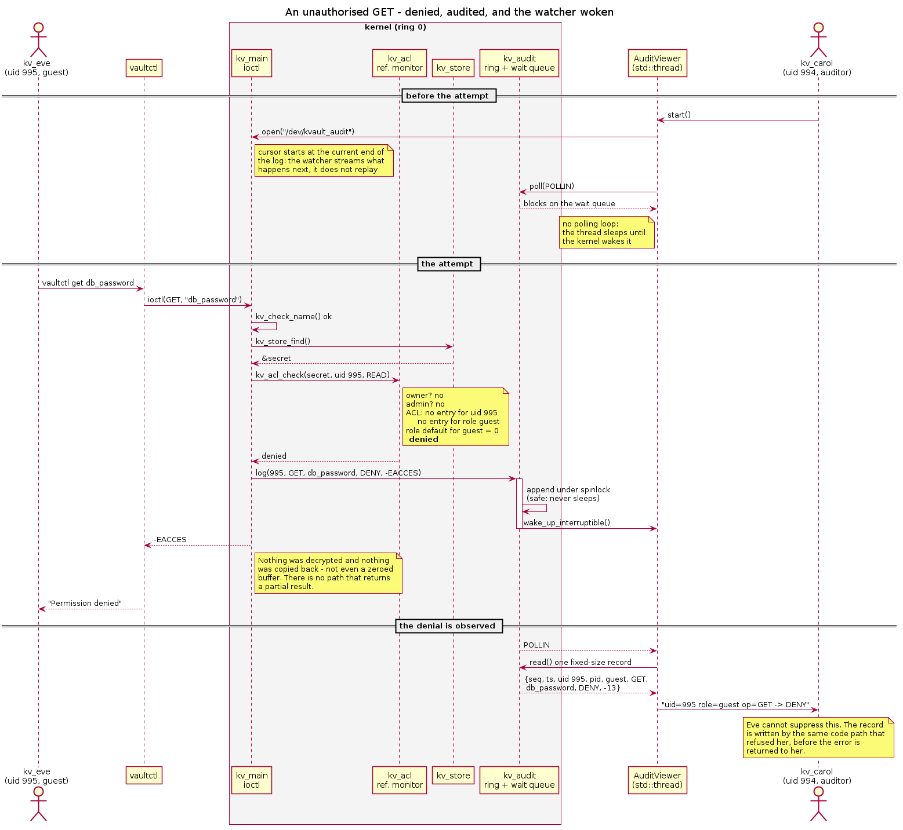

### 13.1 The ring

1024 fixed-size records, power of two (enforced by `BUILD_BUG_ON`), indexed by
`seq & (SIZE - 1)`. `kv_audit_next` counts every record ever written and never
wraps in practice.

**When the ring fills, the oldest records are lost** — new records are never
dropped in favour of old ones. Dropping the newest would let a flood of denials
hide the denial that follows them. The drop count is reported in
`/proc/kvault/stats`.

### 13.2 Why a wait queue and not polling

A reader that has caught up blocks in `wait_event_interruptible()` on
`kv_audit_wq`. `kv_audit_log()` calls `wake_up_interruptible()` after appending.

This is what makes `vaultctl watch` a live stream rather than a poll loop — and
it is the piece of driver machinery most worth demonstrating, because it is
visible: the second terminal sits idle and prints the instant a decision is
taken.

### 13.3 What cannot happen

The record is written **by the same code path that takes the decision, before
the error is returned to the caller**. There is no window in which an access is
refused but unrecorded, and nothing the refused caller can do suppresses it.

### 13.4 Reading the stream

Fixed-size records, so a buffer too small for one record is refused with
`EINVAL` rather than handed a fragment the reader would have to reassemble.
`ioctl` on the audit minor returns `ENOTTY` — it is a stream, not a command
channel.

---

## 14. User space in detail

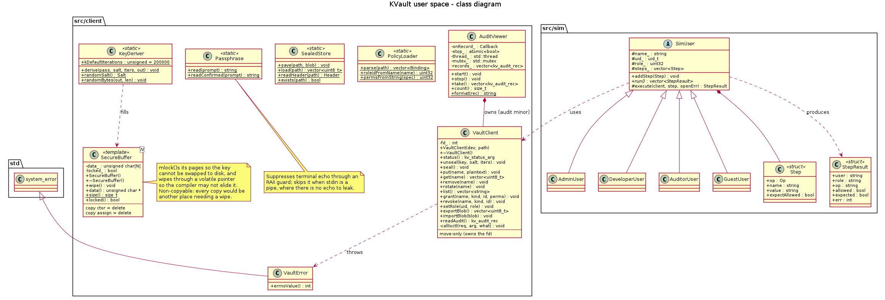

### 14.1 `SecureBuffer<N>` — three C++ ideas in 69 lines

```cpp
template <std::size_t N> class SecureBuffer {
    SecureBuffer();                                  // zero + mlock
    ~SecureBuffer();                                 // wipe + munlock
    SecureBuffer(const SecureBuffer&) = delete;      // non-copyable
    void wipe() noexcept;                            // volatile write loop
};
```

- **RAII**: the wipe happens on destruction, including when an exception
  unwinds the stack.
- **Non-copyable by design**: every copy would be another place holding key
  material that has to be wiped. Deleting the copy operations makes a mistake a
  *compile* error.
- **`volatile` write loop**: the compiler may delete a `memset` whose result is
  provably never read. Writing through a `volatile` pointer makes the stores
  mandatory.
- **`mlock`**: anonymous pages can be written to swap, which would put the
  derived key on disk in the clear. Failure to lock is reported through
  `locked()` rather than thrown — a weaker guarantee is not a broken program.

### 14.2 `VaultClient` — RAII over a file descriptor

Owns the fd; closes it in the destructor, including when an ioctl throws.
**Move-only**: copying would give two objects the same descriptor and a double
`close()`. Opens with `O_CLOEXEC` so a forked-and-exec'd child cannot inherit a
descriptor the reference monitor never saw opened.

Throws `VaultError`, derived from `std::system_error`, carrying the errno so
callers can distinguish `EACCES` (denied) from `EINVAL` (malformed).

### 14.3 `AuditViewer` — the threading piece

Runs `poll()` with a **200 ms timeout** on a `std::thread`. The timeout is not
a polling interval — it is how long `stop()` may take to be noticed. A blocking
`read()` cannot be interrupted by setting a flag, because nothing wakes it.
When records arrive, `poll` returns immediately, because the driver wakes its
wait queue.

Records accumulate under a `std::mutex`; `take()` swaps the vector out.

### 14.4 `SimUser` — the one inheritance hierarchy

```
SimUser (abstract)
 ├── AdminUser
 ├── DeveloperUser
 ├── AuditorUser
 └── GuestUser
```

The subclasses differ in the steps they are given and how an outcome is
interpreted — **not** in how they talk to the kernel. So `run()` is the single
virtual method and everything else is shared.

An auditor who cannot open the control device at all is handled in the base
class: `run()` catches the open failure and records each step as denied with
the errno from `open()`, because "refused by file permissions" is a legitimate
result, not a crash.

### 14.5 The privilege drop — exam-worthy

```cpp
initgroups(user, pw->pw_gid);   // 1. supplementary groups
setresgid(gid, gid, gid);       // 2. group IDs
setresuid(uid, uid, uid);       // 3. user IDs
if (setresuid(0,0,0) == 0) abort();   // 4. verify it took
```

**The order matters and is the classic place to get this wrong:**

1. `initgroups` first — without it the child keeps **root's** supplementary
   groups, so a device node owned by group `kvault` would still be openable for
   the wrong reason and the simulation would prove nothing.
2. `setresgid` **before** `setresuid` — once the real UID is no longer 0 the
   process has lost the privilege needed to change its groups.
3. `setresuid` sets the **saved**-set-uid too, which is what makes the drop
   irreversible. `seteuid()` alone would leave root in the saved slot for the
   child to pick back up.
4. The attempt to regain root is the only way to be *sure*. A simulation whose
   children are secretly still root measures nothing.

---

## 15. Every UML diagram explained

All sources are in `docs/uml/*.puml`; regenerate with
`plantuml -tpng docs/uml/*.puml`.

### 15.1 `01-architecture.png` — component diagram

**Shows:** the two address spaces, the seven kernel components, the user-space
library and the three binaries, and the two device nodes.

**Point at:** the dashed arrows crossing the boundary. Commands and plaintext
go *down* through `/dev/kvault`; audit records come *up* through
`/dev/kvault_audit`; the sealed blob crosses both ways. **The key crosses
exactly once, at unseal, and never comes back.**

**The red box** is `kv_acl` — the reference monitor. Everything routes through
it.

### 15.2 `02-class-userspace.png` — class diagram, user space

**Shows:** the seven library classes and the simulator hierarchy, with
visibility markers and the deleted copy operations.

**Point at:** three things that are load-bearing rather than decorative —
`VaultClient` move-only (owns an fd), `SecureBuffer` non-copyable (owns key
material), and `SimUser` as the only inheritance hierarchy (§14.4).

### 15.3 `03-class-kernel.png` — kernel structures

**Shows:** `kv_vault`, `kv_secret`, `kv_acl_entry`, `kv_uid_role`,
`kv_session`, `kv_audit_rec`, and the three on-disk structs in a separate
package.

**Point at:** it is deliberately a *separate* diagram from 15.2, because these
are C structs — no inheritance, no methods, and the operations on them are free
functions. Drawing them as classes would misrepresent them.

**Also point at:** `kv_uid_role` has **no on-disk counterpart**. That is the
host-configuration-vs-vault-content split of §12.6, visible in the diagram.

### 15.4 `04-seq-unseal-get.png` — sequence: unseal, then an authorised GET

**Shows:** the full key lifecycle in user space and the authorised read path.

**Point at:** the passphrase exists for one function call; the derived key
exists in an `mlock`ed buffer until the ioctl returns; after `~SecureBuffer`
the only copy is in kernel memory. And the note that the KDF parameters come
from the **file**, not the kernel — which is the bug recorded in §20.

### 15.5 `05-seq-denied-get.png` — sequence: a denial

**The most important diagram in the set.** Shows three things that distinguish
KVault from a config file:

1. The decision comes from `current_uid()`, which eve cannot influence.
2. Nothing is decrypted, nothing is copied back — not even a zeroed buffer.
3. The record is written by the same code path that refused her, **before** the
   error is returned.

**Also point at:** the auditor's thread asleep on a wait queue at the top, and
the `wake_up_interruptible()` arrow. That is why `poll` and a wait queue are in
the driver at all.

### 15.6 `06-seq-grant.png` — sequence: a grant changes the outcome

**Shows:** four phases — denied, grant, allowed, revoked-and-denied-again.

**Point at:** the note on Alice's second request — same binary, same arguments,
same credentials, different answer, because *vault state* changed. No restart,
no reload, no cache to invalidate.

**And at step 2:** `GRANT` itself requires the `GRANT` permission (§8.4).

### 15.7 `07-state-vault.png` — vault state machine

**Shows:** four states and every transition, with key-destroying edges marked
in bold.

**Point at:** the `UNSEALED → AUTO_LOCKED` edge (a kernel timer, no user-space
process) and the `LOCKED_OUT` self-loop (correct passphrase refused).

### 15.8 `08-state-secret.png` — secret state machine

**Shows:** `CREATED → ACTIVE → ROTATED`, with `REVOKED` and `DELETED`.

**Point at:** the two notes — the nonce rule (§9.6) and that `REVOKED` is a
view rather than a stored flag (§11.2).

---

## 16. Every screenshot explained

In `docs/screenshots/`, with the raw transcripts in `transcripts/`.

**What they are:** the commands were run for real against a loaded module; the
output was captured to the `.log` files; the PNGs are that same text rendered
in a terminal-styled page so an allow, a denial or a state change is findable
at a glance. They are **renderings of a real session, not photographs of a
screen** — the logs sit beside them so anything in an image can be checked
against the text it came from.

### `01-load.png` — Load

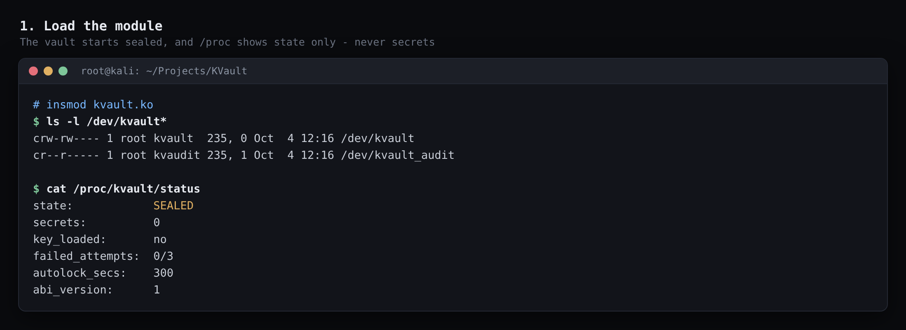

Shows the two device nodes with **different groups** (`kvault` vs `kvaudit`)
and `/proc/kvault/status` reading `SEALED`, `key_loaded: no`.

**The point:** procfs shows lifecycle state and counters only — never a secret
name, never plaintext, never key material. It is world-readable, which
constrains what it may contain.

### `02-unseal.png` — Unseal and brute-force lockout

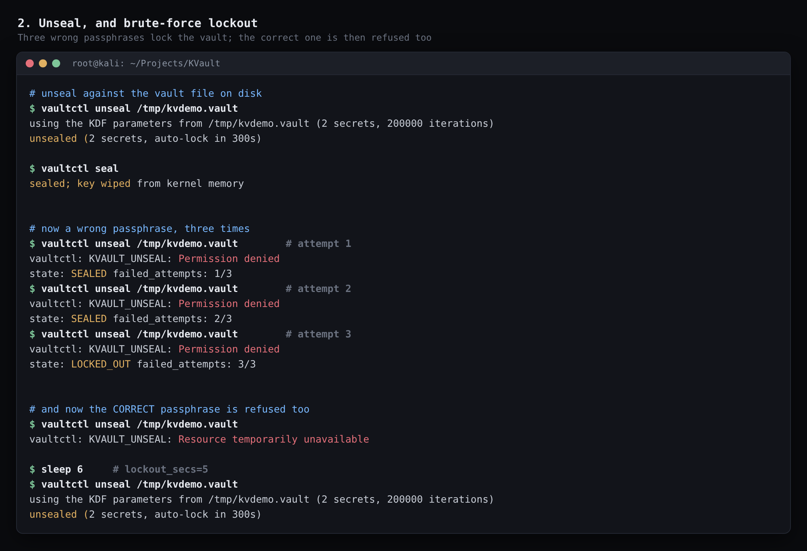

The money shot for FR-7. Unseal from the vault file (note "2 secrets, 200000
iterations" read from the header), seal, then three wrong passphrases:
`1/3 → 2/3 → LOCKED_OUT`. Then **the correct passphrase is refused**
(`Resource temporarily unavailable` = `EAGAIN`), and after the cooldown it
works again.

**The point:** refusing the correct passphrase during lockout is the property
that makes lockout worth having.

### `03-rbac.png` — The reference monitor

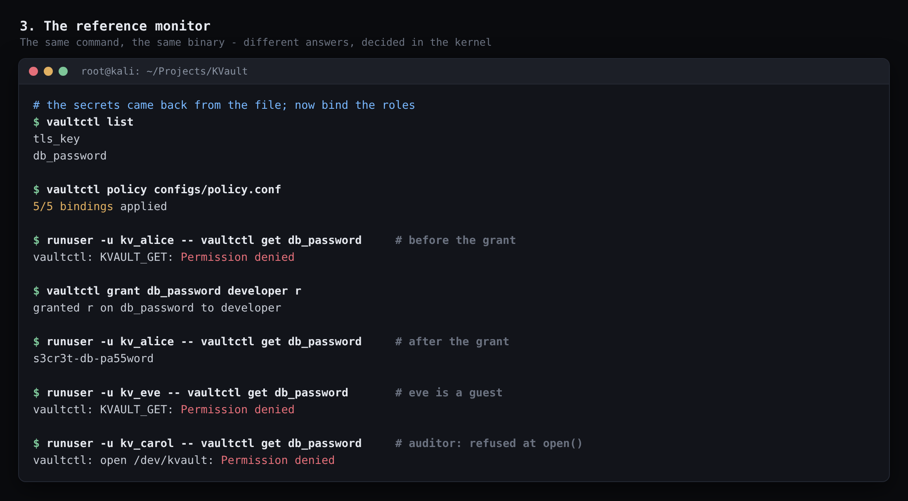

`vaultctl list` shows the secrets came back from the file. Then alice is denied
→ admin grants → **the identical command now succeeds** → eve denied → carol
refused at `open()`.

**The point:** carol's failure says `open /dev/kvault: Permission denied`,
while eve's says `KVAULT_GET: Permission denied`. **Two different layers** —
file permissions, and the reference monitor.

### `04-kvsim.png` — Multi-user simulation

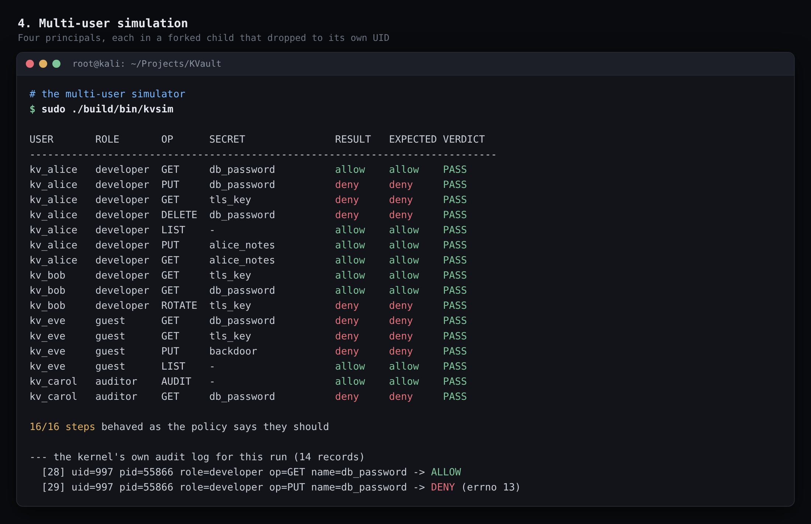

16 steps, four principals, each in a forked child that dropped to its own UID.

**The point:** `kv_alice` and `kv_bob` hold the **same role** and get different
answers, because the role is not the decision — the ACL is. Alice has a
role-subject grant on `db_password`; bob has a UID-subject grant on `tls_key`.

**Also:** `kv_eve  guest  PUT  backdoor  deny` is the fix for the security bug
of §20.5, now asserted by a test.

**Colour note:** allow is green, deny is red, verdict is green — colour is
applied per *token*, because a row contains both words.

### `05-audit-stream.png` — Live audit stream

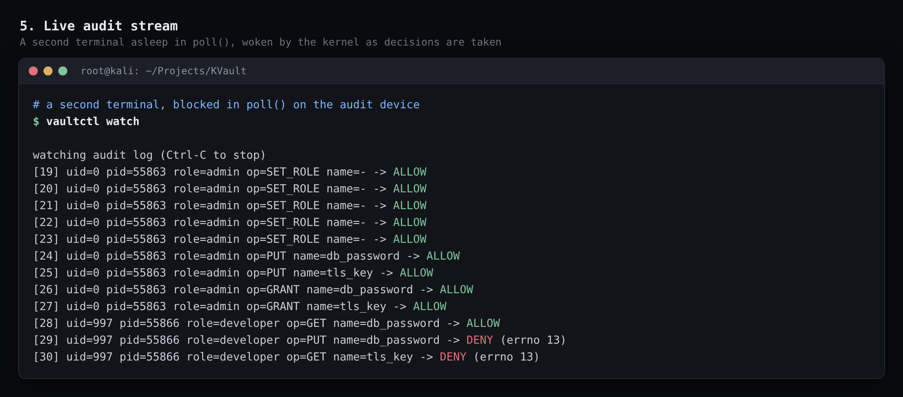

A second terminal running `vaultctl watch`, showing records appearing as the
simulation runs: `SET_ROLE`, `PUT`, `GRANT`, then the per-principal `GET`s with
`ALLOW` and `DENY (errno 13)`.

**The point:** that terminal was asleep in `poll()` on a kernel wait queue. It
was woken by the kernel. This is the driver's `poll`/wait-queue machinery made
visible.

### `06-tamper.png` — The vault file on disk

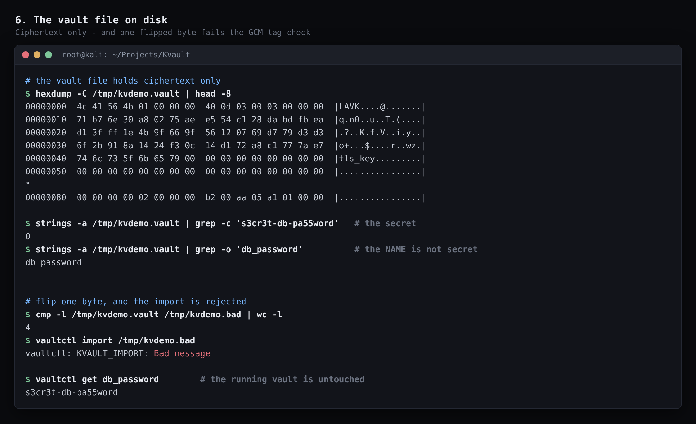

A hex dump showing the `KVAL` magic (as `4c 41 56 4b` — little-endian), then
`grep -c` for the secret returning **0**, and `grep -o` for the *name*
returning `db_password`.

Then: flip one byte → `cmp` reports 4 differing bits → `KVAULT_IMPORT: Bad
message` (`EBADMSG`) → and `vaultctl get db_password` still works.

**Three points:** no plaintext at rest (NFR-1); names are *not* secret and are
visible by design; and the rejected import left the running vault untouched
(two-pass import, §12.4).

### `07-autolock.png` — Auto-lock and unload

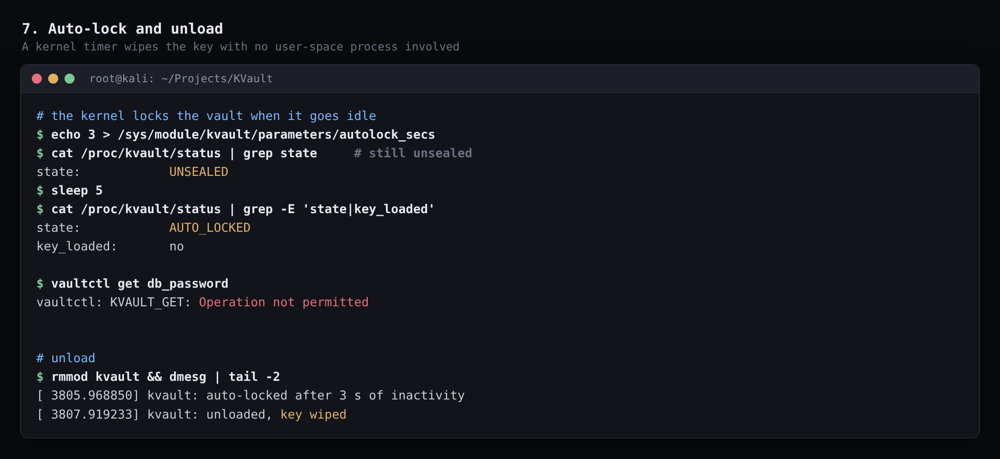

`autolock_secs` set to 3, an operation to re-arm, `sleep 5`, and the state is
`AUTO_LOCKED` with `key_loaded: no`. Then `rmmod` and the dmesg line
`kvault: unloaded, key wiped`.

**The point:** nothing in user space did that. A kernel timer wiped the key.

---

## 17. Operating it: the full command reference

### 17.1 Prerequisites

```bash
sudo apt install build-essential linux-headers-$(uname -r) libssl-dev
# optional, for docs and checks:
sudo apt install plantuml cppcheck valgrind
mokutil --sb-state        # must report: SecureBoot disabled
```

Secure Boot must be off, or an unsigned module is refused at load.

### 17.2 Build

```bash
make              # module + all three binaries
make driver       # kvault.ko only
make user         # vaultctl, kvsim, kvsetup only
make clean
```

Cross-build against a different kernel:

```bash
make driver KDIR=/lib/modules/6.18.9+kali-amd64/build
```

### 17.3 Load and unload

```bash
sudo make load    # creates groups, installs the udev rule, insmods
sudo make unload  # rmmod
```

`make load` does four things, in order, and the order matters: create the
`kvault`/`kvaudit` groups if missing (a `GROUP=` udev rule naming a nonexistent
group silently does nothing), install the rule, reload udev, then `insmod`.

With parameters:

```bash
sudo insmod driver/kvault.ko autolock_secs=30 max_attempts=5 lockout_secs=10
```

### 17.4 Every `vaultctl` command

| Command | What it does |
|---|---|
| `vaultctl status` | Lifecycle state, counters, caller's UID and role, crypto driver |
| `vaultctl watch` | Stream the audit log; blocks until woken by the kernel |
| `vaultctl unseal` | Derive a key from a passphrase and unseal (fresh vault) |
| `vaultctl unseal <file>` | Take the KDF parameters from the file, unseal, and load it |
| `vaultctl seal` | Wipe the key from kernel memory |
| `vaultctl put <name>` | Store a secret **read from stdin** |
| `vaultctl get <name>` | Print a secret to stdout |
| `vaultctl del <name>` | Delete a secret |
| `vaultctl list` | List the names this caller may read |
| `vaultctl rotate <name>` | Re-encrypt under a fresh nonce |
| `vaultctl grant <name> <subject> <perms>` | Grant permissions |
| `vaultctl revoke <name> <subject>` | Drop a subject's ACL entry |
| `vaultctl set-role <user\|uid> <role>` | Bind a user to a role (admin) |
| `vaultctl policy <file>` | Apply every binding in a policy file (admin) |
| `vaultctl export <file>` | Write the sealed vault to disk |
| `vaultctl import <file>` | Reload a sealed vault |

**`<subject>`** is a role name (`admin`, `developer`, `auditor`, `guest`) or
`user:<name|uid>`.
**`<perms>`** is any of `r`, `w`, `d`, `g` — e.g. `rw`, `rwdg`.

The secret is read from **stdin**, never from argv, so it never appears in
`/proc/<pid>/cmdline` where any user on the system could read it.

### 17.5 A complete session

```bash
sudo make load
sudo build/bin/kvsetup                     # create test users and groups

# first unseal adopts the passphrase
printf 'my-passphrase\nmy-passphrase\n' | sudo build/bin/vaultctl unseal

printf 's3cr3t' | sudo build/bin/vaultctl put db_password
sudo build/bin/vaultctl policy configs/policy.conf
sudo build/bin/vaultctl grant db_password developer r

runuser -u kv_alice -- build/bin/vaultctl get db_password   # allowed
runuser -u kv_eve   -- build/bin/vaultctl get db_password   # denied

sudo build/bin/vaultctl export /tmp/vault.kv
sudo build/bin/vaultctl seal
sudo make unload

# later, after a reboot
sudo make load
printf 'my-passphrase\n' | sudo build/bin/vaultctl unseal /tmp/vault.kv
sudo build/bin/vaultctl policy configs/policy.conf   # rebind the roles
sudo build/bin/vaultctl get db_password
```

### 17.6 Inspecting state

```bash
cat /proc/kvault/status      # state, secret count, failed attempts, idle time
cat /proc/kvault/stats       # audit records, drops, crypto driver, limits
dmesg | grep kvault          # load, init, lockout, auto-lock, unload
ls -l /dev/kvault*           # the two nodes and their groups
cat /sys/module/kvault/parameters/autolock_secs
```

### 17.7 Running the tests

```bash
make test                      # unit only; others report as skipped
sudo make load && make test    # adds the integration tier
sudo make test                 # all three tiers
make -C tests bench            # GET throughput and the crypto driver in use
```

### 17.8 The simulator

```bash
sudo build/bin/kvsim                                    # default config paths
sudo build/bin/kvsim configs/policy.conf configs/scenario-default.conf
```

Edit `configs/scenario-default.conf` to change what is seeded, granted and
attempted — the simulator is data-driven.

---

## 18. The live demo script

Five minutes, two terminals. Terminal B is for the audit stream.

| # | Terminal | Command | Say |
|---|---|---|---|
| 1 | A | `sudo make load` then `cat /proc/kvault/status` | "Starts sealed. procfs shows state, never secrets." |
| 2 | B | `sudo build/bin/vaultctl watch` | "This is now asleep on a kernel wait queue. Not polling." |
| 3 | A | `printf 'wrong\n' \| sudo build/bin/vaultctl unseal /tmp/vault.kv` ×3 | "1/3, 2/3, locked out." |
| 4 | A | correct passphrase, still refused | **"Even the right passphrase is refused. That is the point."** |
| 5 | A | after the cooldown, unseal properly | "And it recovers." |
| 6 | A | `put db_password`, `grant db_password developer r` | Watch terminal B light up. |
| 7 | A | `runuser -u kv_alice -- ... get db_password` | "Allowed." |
| 8 | A | `runuser -u kv_eve -- ... get db_password` | "Denied — and recorded in B before the error reached her." |
| 9 | A | `sudo build/bin/kvsim` | "Four users, forked children, real UID drops. 16/16." |
| 10 | A | `hexdump -C /tmp/vault.kv \| head` | "Ciphertext. Names visible — they are not secret." |
| 11 | A | flip a byte, `import` | "`Bad message`. The GCM tag caught it." |
| 12 | A | `get db_password` | "And the running vault is untouched — two-pass import." |
| 13 | A | shorten `autolock_secs`, wait | "The kernel locked it. Nothing in user space was involved." |
| 14 | A | `sudo make unload`, `dmesg \| tail` | "`key wiped`." |

**If you only have 90 seconds:** steps 4, 8, 9 and 11.

---

## 19. Interview questions and answers

### 19.1 The five from the brief

**Q: Why enforce access in the kernel instead of the application?**

Three reasons, in order of strength:

1. **The boundary is enforced by hardware.** Vault state lives in ring 0. A
   user-space process cannot `ptrace` it, read its address space, or core-dump
   it — not because permissions forbid it but because the CPU does not permit
   the access. A daemon holding a key is a process like any other; anything
   running as the same user can read its memory.
2. **Identity needs no protocol.** `current_uid()` is not a claim the caller
   makes; it is what the kernel already knows about the process that entered
   the syscall. There is no handshake to implement incorrectly, no credential
   to replay, no session to hijack.
3. **There is nothing to bypass.** A daemon can be ignored by anyone who can
   read its backing store directly. Here the device is the only path to the
   ciphertext and the key exists nowhere else.

Be honest about the cost: a bug in this code is a kernel bug. That is why the
module does as little as possible, validates every byte crossing the boundary,
and keeps the untrusted-input parser in one file with explicit bounds
arithmetic.

**Q: Why GCM rather than CBC?**

Because tamper detection is a requirement, not an extra. CBC gives
confidentiality only. To detect modification I would have to add a MAC and get
the composition right — encrypt-then-MAC, with a separate key, which is a
classic source of bugs. GCM is an AEAD: it authenticates in the same pass, and
the tag is what makes a flipped byte in the vault file a rejected import rather
than silent corruption. I also use the AAD field to bind each ciphertext to its
secret's name, which CBC-plus-MAC would not have given me for free.

**Q: Why `memzero_explicit` instead of `memset`?**

Because the compiler is allowed to delete a `memset` whose result is provably
never read — and that is exactly the situation when wiping a buffer just before
freeing it. The write is dead code by the compiler's reasoning, and it is
entitled to remove it. `memzero_explicit` uses a barrier that prevents the
optimisation. In user space I do the same thing with a `volatile` write loop in
`SecureBuffer::wipe()` and with `OPENSSL_cleanse` for strings. This is a real
observed behaviour at `-O2`, not folklore.

**Q: How is `current_uid()` trustworthy?**

Because it is not something the caller sends. It is read from the `struct cred`
attached to the calling task, which only the kernel writes. A process can
change its UID only through a syscall the kernel itself authorised — `setuid`
and friends, which enforce their own rules. By the time control reaches my
ioctl handler the identity is already established, and there is no field in my
ABI through which a caller could assert a different one. Contrast a daemon,
which has to *ask* who is calling — `SO_PEERCRED` is good, but it is a protocol
with a surface.

I capture it at `open()` into the per-fd session, and I also call `capable()`
at the moment of the operation for the admin check.

**Q: What stops root from reading secrets?**

Nothing, and I would not claim otherwise. Root can load a module, read kernel
memory where that is configured, patch the running kernel, or `rmmod` mine and
substitute its own. My threat model names this explicitly in §3.2 of the design
document: the adversary is a local, unprivileged or *differently*-privileged
process — another service account, a compromised application, a developer with
a shell. The honest claim is that KVault raises the bar from "any process
running as the same user" to "ring 0", and gives you a record of everything
that was tried along the way.

Hardware-backed storage — a TPM or an HSM — is what you use when root is in
your threat model. KVault is explicitly a *software* TPM-like device.

### 19.2 Questions they are likely to add

**Q: What happens if two processes call `GET` at the same time?**

They serialise on `kv_vault.lock`. Operations are short — a full `GET` round
trip is about 1.3 µs — so contention is not the limit. I tested it: 8 processes
× 50 concurrent reads and 6 threads × 40 interleaved put/get/list, asserting
each caller gets *its own* plaintext back. Zero mismatches. A shared scratch
buffer, or a transform whose key one thread overwrote mid-operation, would have
shown up there.

**Q: Why one big lock? Isn't that a bottleneck?**

Measured rather than assumed — see above. And there is a second reason I could
not avoid it: the AEAD transform is shared and `crypto_aead_setkey` writes to
it, so two concurrent crypto operations would race on the key regardless.
Finer-grained locking would buy throughput nobody needs at the cost of
correctness arguments I would not want to make in kernel code.

**Q: Your audit log is in a ring buffer. What if it fills?**

The oldest records are overwritten and a drop counter is exposed in
`/proc/kvault/stats`. That direction is deliberate: dropping the *newest*
records would let an attacker flood the log with noise to hide the one entry
that matters. Blocking the writer instead would make a slow reader into a
denial of service on the whole vault. Losing old records and saying so is the
least-bad option. A production version would stream to persistent storage.

**Q: Why is the secret's name authenticated but not encrypted?**

Because the kernel needs to find an entry by name before it has decrypted
anything — a name has to be in the clear to be an index. Authenticating it is
what matters: it binds each ciphertext to its entry, so an attacker who edits
the file cannot move `db_password`'s ciphertext under `public_motd`'s name and
read it through a secret they are allowed to read. The demo shows names visible
in the hex dump, which is by design, and the design document says names are not
secret.

**Q: What if the module crashes or is force-unloaded?**

`rmmod` runs `kvault_exit`, which seals (wiping the key with
`memzero_explicit`), clears the store with `kfree_sensitive`, and deletes the
timer with `timer_delete_sync` so no callback can fire into freed memory. On an
actual oops the key is in kernel memory, which is not written to a crash dump
unless the system is configured to dump — a limitation I would note rather than
claim to have solved.

**Q: How do you know there are no memory leaks?**

Repeated load/unload cycles under a workload that creates, rotates and deletes
secrets, with `dmesg` clean — no warnings, no lockdep complaints, no slab
errors. I am honest in the test report that this is weaker than `kmemleak`,
which needs a boot parameter and a reboot I did not take. Every allocation path
has a matching free on every error path, which is why the `goto`-based cleanup
ladder in `kvault_init` unwinds in reverse order.

**Q: Why PBKDF2 rather than Argon2 or scrypt?**

Argon2 is the better choice on the merits — it is memory-hard, which makes GPU
and ASIC attacks far more expensive. I used PBKDF2 because it is in OpenSSL's
stable API and the KDF is not where this project's contribution lies. The
iteration count is a parameter in the file header, so raising it does not break
existing vaults, and swapping the KDF would be a contained change: user space
derives the key and the kernel never sees the algorithm.

**Q: Your vault file contains secret names and owner UIDs. Is that a leak?**

It is a deliberate trade-off, stated in the design. Names have to be readable
to index entries without decrypting the whole file, and UIDs have to be
readable to reconstruct ownership. If names were sensitive you would encrypt
the whole file with a second key — but then you cannot do partial loads or
selective decryption. For the threat model here — the file at rest, with an
attacker who does not have the passphrase — names are metadata, and
`stripe_live_key` existing is less damaging than its value leaking.

**Q: What is the performance cost?**

A full `GET` — ioctl, reference monitor, decrypt, copy out — is 1.3 µs for a
16-byte secret, rising to 2.9 GB/s throughput at 4 KiB. The small-size number
is almost entirely syscall and policy-check overhead; the cipher is noise
there. I would not read the 12 MB/s figure at 16 bytes as saying anything about
AES.

**Q: Could you support more than one vault?**

Yes, and it is a clean extension: the hash table and the ACL code are unchanged,
and you would key them by a vault ID carried in the session. I chose one vault
because it matches the TPM analogy and halves the state to reason about. The
design document lists it under rejected alternatives with that reasoning.

**Q: Why are roles compiled in rather than configurable at runtime?**

Because runtime roles would be a second policy surface *inside the kernel* with
no security gain. The roles are few and stable — admin, developer, auditor,
guest. What *is* configurable is who holds a role, which is the part that
actually varies between deployments, and that lives in `policy.conf` in user
space and is pushed in with `SET_ROLE`.

**Q: What does the `0644` on your module parameters mean, and is it safe?**

They are readable by anyone and writable by root through
`/sys/module/kvault/parameters/`. Writable-by-root is the same privilege level
that can unload the module entirely, so it adds no exposure. The system test
uses it to shorten `autolock_secs` so the timer can be demonstrated without
reloading the module and re-entering the passphrase.

**Q: Why does `vaultctl put` read from stdin?**

So the secret never appears in `argv`. Anything in `argv` is visible in
`/proc/<pid>/cmdline` to any user on the system for the lifetime of the
process, and it lands in shell history. Reading stdin keeps it off both.

**Q: What is the hardest bug you hit?**

Persistence silently breaking across a module reload. Unsealing succeeded,
`IMPORT` then failed with `EACCES`, and the vault *looked* corrupt when it was
fine. The cause was that the salt lived only in the kernel, so a freshly loaded
module generated a new one, derived a different key, and the key-check value in
the file did not match. The fix was a design change: the file header is the
authority on KDF parameters, and user space reads them before deriving. It also
taught me the general shape — importing needs the key, the key needs the salt,
the salt is in the file, so *something* outside the kernel has to read that
header.

**Q: What would you do differently?**

Write the ABI header against the compiler rather than against a diagram — both
`_IOC_SIZEBITS` defects would have surfaced in minutes. Install headers for the
running kernel before writing a line; my first build was against the wrong tree
and proved less than it appeared to. And write the simulator earlier: it found
the only genuine security hole in the project, the first time it ran a complete
scenario.

---

## 20. Defects found, and what found them

Six defects. **None were found by reading the code.** That distribution is the
most useful thing to say about the testing.

| # | Defect | Found by | Fix |
|---|---|---|---|
| 1 | AES-NI reported absent on a CPU that has it | Loading the module and reading `/proc/kvault/stats` | Match accelerated driver families; report the driver name |
| 2 | Persistence broken across a module reload | The RBAC/persistence session | The file header is the authority on KDF parameters |
| 3 | Privilege drop changed only the UID, keeping root's groups | Reasoning about why group permissions would be meaningless | `initgroups` → `setresgid` → `setresuid` |
| 4 | An auditor who cannot open the control device crashed the forked child | First run with carol in `kvaudit` only | Opening is part of what the step tests |
| 5 | **A guest could create a secret** | `kvsim` — the step expected a denial and got an allow | `kv_role_may_create()`, plus a `max_secrets` bound |
| 6 | A skipped test case printed `ok` | Reading a run where auto-lock reported green without executing | Harness reports `SKIP`; suite restructured so nothing skips |

### 20.5 The one that matters

A guest with no permissions at all could bring a name into existence — and
become its **owner**, and owners have full control.

**The attack:** squat a name an application expects to own. The application's
own writes are then refused (denial of service), or worse, the squatter reads
whatever the application later stores under that name.

**Why it was invisible to inspection:** every individual check in `PUT` was
correct. The missing one had no obvious place to be, because it answers a
question ACLs structurally cannot — there is no object yet. Only a test that
asserted "this should be denied" could notice that it was not.

**Why it is good interview material:** it shows the difference between code
that is correct in every line and code that is correct as a system, and it
shows a test finding something review would not.

---

## 21. Testing

### 21.1 Three tiers

| Tier | Needs | Cases |
|---|---|---|
| unit | nothing | 33 |
| integration | module loaded, device openable | 19 |
| system | root; changes vault state | 4 |

That is **56 automated cases**. Plus 16 simulator steps and a 26-check
RBAC/persistence session: **98 checks in total, all passing.**

A case that cannot run reports `SKIP` and is counted separately — never as a
pass. A suite trusted for coverage it does not have is worse than no suite.

### 21.2 The harness

`tests/kvtest.hpp`, 188 lines, no external framework — the project is C/C++
only and pulling in a dependency to compare two integers is a poor trade.

- `KV_CHECK` records a failure and continues.
- `KV_REQUIRE` abandons the case, so one failed precondition does not report a
  cascade of consequences that hide the cause.
- `KV_EXPECT_ERRNO(expr, err)` asserts *which* errno. Asserting only that
  something threw would pass when the kernel returns the wrong error for the
  right reason.

### 21.3 Negative testing

The integration suite spends more effort on inputs a correct caller would never
send than on the happy path: unknown ioctls, foreign magic, empty and over-long
names, zero-length and over-length values, both size boundaries, values with
embedded NULs, undefined permission bits, garbage blobs, a flipped bit, and
operations while sealed.

**The fuzz:** 400 iterations of random names (0–71 bytes, arbitrary byte
values) and random lengths (0–4159 bytes), with a **fixed seed** so a failure
reproduces. Every refusal carried a documented errno; anything *accepted* was
read back and compared, so a lenient validator cannot pass by accident.

### 21.4 What the system tier proves

Concurrency (§10.1), the auto-lock timer driven through the module parameter so
no passphrase is needed, and that a locked vault refuses everything while its
`secret_count` stays non-zero — the distinction between locking a vault and
emptying it.

---

## 22. Syllabus coverage map

| Area | Where to point |
|---|---|
| **Device drivers** | `cdev` with two minors; `file_operations`; per-open session in `private_data`; `unlocked_ioctl` + `compat_ioctl`; `copy_to_user`/`copy_from_user`; wait queue + `poll`; kernel timer; mutex and spinlock; `hlist`; `kzalloc`/`kfree_sensitive`; procfs; `module_param`; kernel crypto API |
| **Linux system programming** | UIDs/GIDs; `fork`; `initgroups`/`setresgid`/`setresuid`; `waitpid`; pipes; `poll`; `mlock`; `O_CLOEXEC`; termios; the temp+fsync+rename write pattern; udev rules; `getpwnam`/`getgrnam`; `execvp` |
| **C++** | Class hierarchy (`SimUser` → four subclasses); RAII (`VaultClient`, `SecureBuffer`, `EchoOff`, `Fd`); deleted copy operations; move semantics; templates (`SecureBuffer<N>`); STL containers; `std::unique_ptr`; exceptions derived from `std::system_error`; `std::thread`, `std::mutex`, `std::atomic` |
| **Computer architecture** | Ring 0 vs ring 3 as the security boundary; AES-NI/VAES hardware acceleration and driver selection by priority; why a compiler may elide a memory wipe; endianness in the on-disk format; constant-time comparison vs timing side channels |
| **Hardware/software interface** | The driver as a software TPM/HSM-like device; the ioctl interface as a command register set; `_IOC_SIZEBITS` as a hardware-like ABI constraint |
| **Security** | Confidentiality (AES-GCM); integrity (GCM tag, AAD binding); RBAC; least privilege; reference monitor; audit trail; brute-force mitigation; fail-closed design; defence in depth (groups + RBAC) |

---

## 23. Troubleshooting

| Symptom | Cause | Fix |
|---|---|---|
| `insmod: ERROR: could not insert module: Invalid module format` | Built against the wrong kernel | `sudo apt install linux-headers-$(uname -r)`, then `make clean && make driver` |
| `insmod: Key was rejected by service` | Secure Boot is on | Disable it in firmware; check with `mokutil --sb-state` |
| `open /dev/kvault: Permission denied` as a normal user | Not in the `kvault` group, or the udev rule is not installed | `sudo make load` does both; `newgrp kvault` or re-login for group changes |
| `KVAULT_GET: Operation not permitted` (`EPERM`) | The vault is sealed or auto-locked | `vaultctl unseal` |
| `KVAULT_UNSEAL: Resource temporarily unavailable` | Locked out | Wait `lockout_secs` |
| `KVAULT_UNSEAL: Operation already in progress` | Already unsealed | `vaultctl seal` first, or just proceed |
| `KVAULT_IMPORT: Permission denied` after a reload | Unsealed with a fresh salt instead of the file's | `vaultctl unseal <file>`, not bare `unseal` |
| `KVAULT_IMPORT: Bad message` | The file was modified | Tamper detection working; restore a good copy |
| `kvsim: no such user 'kv_alice'` | Test users not created | `sudo build/bin/kvsetup` |
| The vault locks itself mid-demo | `autolock_secs` default is 300 | Load with `autolock_secs=0` for a long demo |
| Everything denied after a module reload | Role bindings are not in the vault file | `vaultctl policy configs/policy.conf` |

---

## 24. Glossary

| Term | Meaning |
|---|---|
| **AAD** | Associated data — authenticated but not encrypted by an AEAD |
| **AEAD** | Authenticated Encryption with Associated Data |
| **AES-NI / VAES** | CPU instruction sets accelerating AES |
| **cdev** | The kernel's character device abstraction |
| **ACL** | Access Control List — per-object permission entries |
| **GCM** | Galois/Counter Mode — an AEAD mode for block ciphers |
| **ioctl** | The catch-all device control syscall |
| **KCV** | Key-check value — a hash of the key, used to verify a passphrase |
| **KDF** | Key derivation function — PBKDF2 here |
| **minor number** | Distinguishes devices sharing one driver |
| **nonce** | Number used once — must never repeat under one key |
| **PBKDF2** | Password-Based Key Derivation Function 2 |
| **RBAC** | Role-Based Access Control |
| **reference monitor** | The unbypassable, tamper-proof, verifiable component every access passes through |
| **ring 0 / ring 3** | CPU privilege levels: kernel and user |
| **softirq** | Deferred kernel interrupt context — cannot sleep |
| **wait queue** | Kernel mechanism to sleep until woken by an event |

---

*KVault — Dripta Pandit. Kernel module, user-space tooling, tests and
documentation. Verified on Linux 7.1.5+kali-amd64.*
